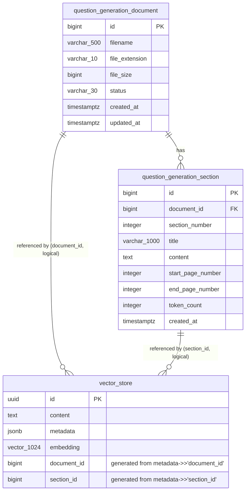

# Document Database

## Table of Contents

<!-- toc -->

- [Introduction](#introduction)
- [Database Purpose](#database-purpose)
- [Repository Structure](#repository-structure)
- [Database Migration Strategy](#database-migration-strategy)
- [Requirements](#requirements)
- [Run PostgreSQL Locally](#run-postgresql-locally)
- [Apply Liquibase Changes](#apply-liquibase-changes)
- [Liquibase Contexts](#liquibase-contexts)

<!-- tocstop -->


# Introduction

The **Document Database** repository contains database schema definitions 
and migration scripts for documents upload on the Internal Knowledge Platform.

The database stores:

- Embeddings of the uploaded documents.

# Database Purpose

The database follows the following principles:

- PostgreSQL database
- Liquibase based database versioning
- Immutable migration scripts
- Database-first schema management



# Database Migration Strategy

Liquibase changelog contains all scripts.

## Schema

Contains database structure:

- Schema creation
- Extensions
- Tables

Executed in all environments.

# Requirements

Required:

1. Git
2. Docker
3. Docker Compose

---

# Run PostgreSQL Locally

```text
Clone repository
|
v
docker compose up
|
v
Build liquibase image
|
v
Run Liquibase migration
|
v
Database ready
```

The local development environment uses Docker Compose.

The Docker environment contains:

- PostgreSQL database
- Database initialization scripts


## Docker Structure

```
docker
│
├── docker-compose.yml
│
└── pgvector-scripts
    └── init.sql
```

`init.sql` is executed automatically when the PostgreSQL container is created for the first time.

It is responsible for:

- Creating database users
- Creating database
- Initial database configuration


## Start PostgreSQL Container

From the project root:

```bash
cd docker

docker compose up -d
```

Verify running containers:

```bash
docker ps
```

Expected result:

```text
postgres container is running
```


## Stop PostgreSQL Container

```bash
docker compose down
```

Remove volumes:

```bash
docker compose down --remove-orphans --volumes
```

> Removing volumes deletes the local database data.


# Apply Liquibase Changes

Liquibase migrations are executed using a custom Docker image with PostgreSQL support.


## Repository Structure

```
project-root

├── docker
│   |
│   └── liquibase-dockerfile-to-image
│       |
│       ├── Dockerfile
│       └── README.md
│
└── resources
    |
    └── liquibase
        |
        └── liquibase-changelog.xml
```


# Create Liquibase Docker Image

Navigate to the Liquibase Docker image directory:

```bash
cd docker/liquibase-dockerfile-to-image
```

Build the image:

```bash
docker build -t liquibase-pg .
```

The image contains:

- Liquibase 5.0.0
- Java 21
- PostgreSQL Liquibase extension


Verify image:

```bash
docker images
```

Expected:

```text
liquibase-pg
```


# Execute Liquibase Migration

Run the Liquibase container from the project root directory.

Example:

```bash
docker run --rm \
-v ./resources/liquibase:/liquibase/changelog \
liquibase-pg \
--url=jdbc:postgresql://<HOST_IP>:5433/document_db \
--username=document_user \
--password=postgres \
--changeLogFile=liquibase-changelog.xml \
--contexts=dev \
update
```

Replace:

```text
<HOST_IP>
```

with **CONTAINER_NAME**.

## PostgreSQL Storage

PostgreSQL uses a Docker named volume:

postgres-data

This is intentional because PostgreSQL requires Linux filesystem permissions.
Using a bind mount from Windows filesystem (`/mnt/c`) may cause permission errors during database initialization.

The database scripts are mounted separately:

./docker/pgvector-scripts
|
v
/docker-entrypoint-initdb.d


# Successful Migration Output

Expected output:

```text
Starting Liquibase at 20:39:28 using Java 21.0.8
(version 5.0.0)

Liquibase Version: 5.0.0

Running Changeset:
liquibase-changelog.xml::1::pm

Running Changeset:
liquibase-changelog.xml::2::pm

...

Liquibase command 'update' was executed successfully.
```


# Liquibase Contexts

The project uses Liquibase contexts to control environment-specific data.


## Development Environment

Run with:

```bash
--contexts=dev
```

Executed:

- Database schema
- Reference data

## Production Environment

Run with:

```bash
--contexts=prod
```

Executed:

- Database schema
- Reference data

## Troubleshooting 

```bash
docker logs <CONTAINER_NAME>
e.g.
docker logs pgvector-postgres
```

Developer Machine (WSL2)

                Docker Network
              knowledge-network
                     |
        +------------+------------+
        |                         |
        v                         v

pgvector-postgres          liquibase-pg
(PostgreSQL 17)             (Liquibase 5)

        |
        |
        v

Docker Named Volume
pgvector-data

        |
        |
        v

PostgreSQL data files
(Linux filesystem managed by Docker)

